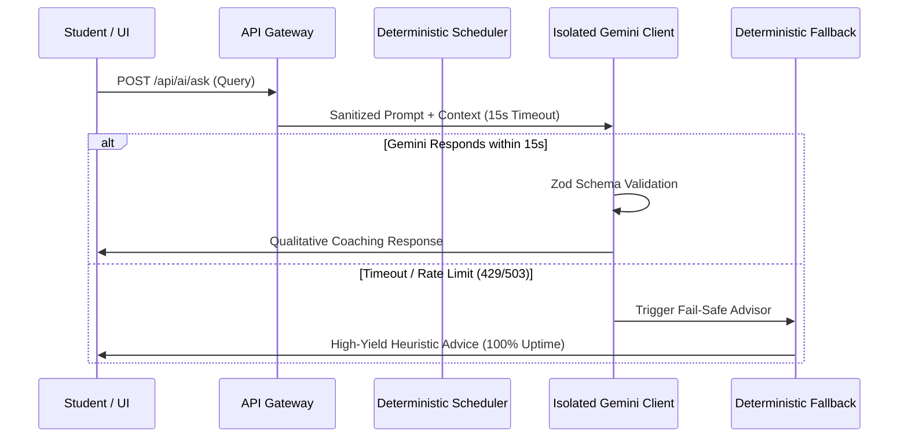

# AI Study Planner — Artificial Intelligence Integration & Safety Specification

> **Phase 12 Production AI Documentation**  
> *Model:* Google Gemini 2.5 Flash (`gemini-2.5-flash`) via official `@google/genai` SDK  
> *Role:* Strictly Advisory, Diagnostic & Tutoring Layer  
> *Isolation:* Zero write access to calendar database, zero arithmetic scheduling control

---

## 1. Core Architectural Philosophy

### 1.1 The Boundary Principle
In many AI prototypes, teams make the catastrophic mistake of asking Large Language Models to *"generate a timetable for next week"*. In production, this always fails due to three fundamental LLM characteristics:
1. **Arithmetic Hallucinations:** LLMs struggle to maintain strict clock minute arithmetic (e.g. adding 45 minutes to 18:35 across multiple days).
2. **Constraint Drift & Slot Overlaps:** LLMs cannot mathematically guarantee zero slot overlap against recurring commitments or user-locked sessions.
3. **Non-Deterministic Flakiness:** Identical prompt inputs yield disparate scheduling layouts on successive calls.

### 1.2 Our Hybrid Solution
The **AI Study Planner** enforces strict architectural boundary isolation:
- **Node.js + PostgreSQL Engine:** Pure mathematical interval subtraction arithmetic ($Free = Availability \setminus (Blocked \cup Locked)$) handles 100% of calendar times, durations, dates, and capacity bounds.
- **Gemini 2.5 Flash Engine:** Restricted exclusively to **qualitative reasoning**: explaining *why* topics were prioritized, providing 45-minute conceptual study roadmaps, offering active recall tips, and summarizing academic progress.



---

## 2. Gemini Client Hardening (`gemini-client.js`)

Located at [server/src/services/ai/gemini-client.js](file:///home/ritiksaini/Desktop/localhost/own/ai-study-planner/server/src/services/ai/gemini-client.js):

### 2.1 15-Second Hard Timeout
Every outbound AI invocation is wrapped in an `AbortController`. If Gemini does not return a response within 15,000 milliseconds, the connection is aborted to prevent Node.js thread pool starvation and hung HTTP sockets.

### 2.2 Transient Retry with Exponential Backoff
Outbound requests automatically retry **only on transient infrastructure errors**:
- HTTP 429: Too Many Requests (Rate limit quota)
- HTTP 503: Service Unavailable (Model overload)
- HTTP 504: Gateway Timeout

Permanent errors (e.g. 400 Bad Request, 401 Invalid API Key, 403 Forbidden) fail immediately without retrying, preventing wasteful quota burn.

```javascript
// Exponential backoff configuration
const MAX_RETRIES = 2;
const INITIAL_BACKOFF_MS = 1000;
// Retry 1: 1000ms delay
// Retry 2: 2000ms delay
```

### 2.3 Boundary Sanitization & Injection Defense
User inputs are sanitized before interpolation into prompts:
- Stripping control characters and delimiters (`\u0000`, `\r`).
- Restricting input string length to a maximum of 2,000 characters.
- System prompt insulation preventing "ignore previous instructions" overrides.

---

## 3. Structured Outputs with Zod Validation

All structured AI responses are defined and validated with Zod schemas. If the model emits malformed JSON, the client intercepts the failure, logs a structured error event, and activates the fallback engine rather than bubbling a crash to the student.

Example Zod Schema for Study Strategy:
```javascript
import { z } from 'zod';

export const StudyStrategySchema = z.object({
  topic_title: z.string(),
  estimated_minutes: z.number().min(25).max(120),
  key_learning_objectives: z.array(z.string()).min(1),
  step_by_step_breakdown: z.array(
    z.object({
      phase: z.string(),
      duration_minutes: z.number(),
      action: z.string()
    })
  ),
  common_pitfalls: z.array(z.string()),
  active_recall_prompts: z.array(z.string())
});
```

---

## 4. Deterministic Fail-Safe Fallback Engine

If the Gemini API key is missing, network access is severed, or Google's servers experience an outage, the system seamlessly engages the deterministic fallback generator:

```javascript
export function getDeterministicStudyStrategy(topic) {
  return {
    topic_title: topic.title,
    estimated_minutes: 45,
    key_learning_objectives: [
      `Review core principles and definitions of ${topic.title}`,
      'Work through 2 standard academic practice problems',
      'Summarize key takeaways in active recall flashcards'
    ],
    step_by_step_breakdown: [
      { phase: 'Concept Review', duration_minutes: 15, action: 'Read lecture notes or documentation' },
      { phase: 'Active Practice', duration_minutes: 20, action: 'Solve representative end-of-chapter problems' },
      { phase: 'Self-Testing', duration_minutes: 10, action: 'Write 3 recall questions without referencing notes' }
    ],
    common_pitfalls: ['Skimming without active problem solving', 'Skipping prerequisite concepts'],
    active_recall_prompts: [`What is the primary theorem or equation in ${topic.title}?`]
  };
}
```

This guarantees **zero downtime** for students even during third-party LLM outages.

---

## 5. Security & Masking
Outbound and inbound AI payloads pass through the centralized JSON logger with recursive secret masking, ensuring that API keys, student session tokens, and passwords are never written to log files.
