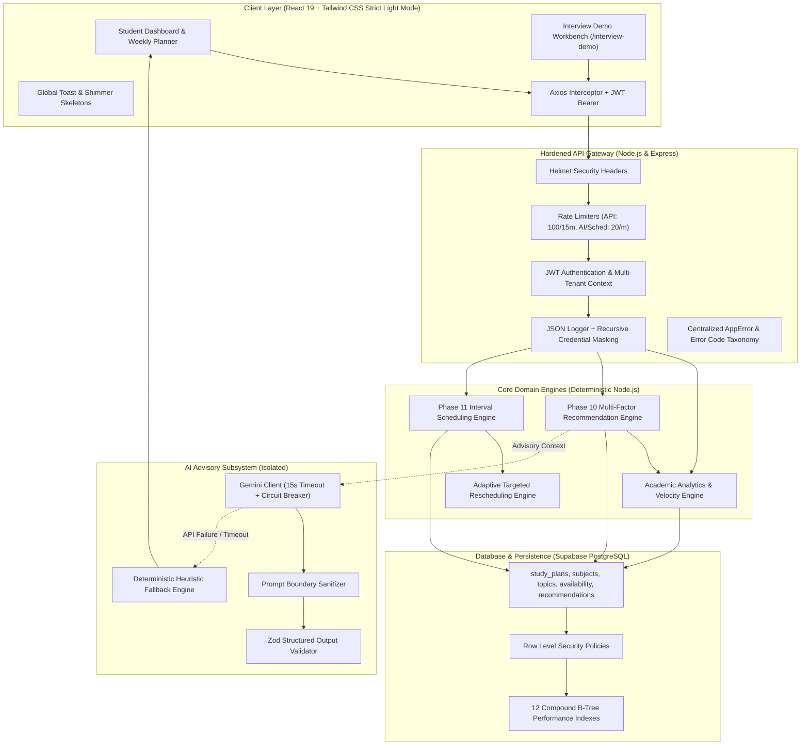

# AI Study Planner — System Architecture Blueprint

> **Phase 12 Production Architecture Documentation**  
> *An adaptive, multi-tenant academic study planning and recommendation platform combining deterministic constraint-satisfaction scheduling with isolated AI advisory coaching.*

---

## 1. Executive Summary & Core Principles

The **AI Study Planner** is architected to address the fundamental flaw in traditional study planners: **plan fragility**. In conventional calendar applications, static timetables collapse whenever a student misses a session or encounters a difficult topic. 

Our system solves this via a **hybrid closed-loop architecture**:
1. **Mathematical Determinism for Time & Constraints:** Calendar intervals, fatigue bounds, cognitive break insertions, and capacity arithmetic are strictly executed by deterministic algorithms in Node.js and PostgreSQL. This guarantees **zero slot overlaps, zero arithmetic hallucinations, and zero capacity violations**.
2. **Boundary-Isolated AI for Qualitative Advisory:** Large Language Models (Google Gemini 2.5 Flash) operate strictly as an advisory and tutoring layer. The AI has **read-only access to academic telemetry and zero write access to the calendar database**.
3. **Hardware-Enforced Multi-Tenancy:** Supabase Auth and PostgreSQL Row Level Security (RLS) guarantee complete data isolation between student tenants.
4. **Strict Light Color Theme:** Built exclusively with a modern, high-contrast light theme palette (`bg-slate-50`, `bg-white`, `border-slate-200`, `text-slate-900`) adhering to WCAG 2.1 AA accessibility guidelines.
5. **Non-Destructive Horizon Recalibration:** Future timetable optimizations produce ephemeral candidate previews before the student explicitly commits changes to the database.

---

## 2. High-Level System Architecture



---

## 3. Subsystem Breakdown

### 3.1 Presentation Layer (Frontend)
- **Technology:** React 19, Vite, Tailwind CSS, Lucide React, Axios.
- **Strict Theme Policy:** Fully compliant with `.agents/rules/ui-theme.md`. Zero dark theme classes. Clean slate backgrounds (`bg-slate-50`), white card surfaces (`bg-white`), slate borders (`border-slate-200`), high-contrast slate text, and semantic accents (Indigo for primary actions, Emerald for completions/success, Amber for warnings, Violet for recommendations).
- **Core Components:**
  - `WeeklyPlanner.jsx`: Interactive 7-day responsive grid with drag-free keyboard navigation, day selection, and session cards.
  - `SmartOptimizationModal.jsx`: Non-destructive modal providing parameter controls for horizon days, session length, and daily limits.
  - `PlanPreviewModal.jsx`: Diff viewer comparing proposed timetable slots against existing commitments before committing.
  - `InterviewDemo.jsx`: Interactive capstone presentation dashboard featuring live health probes, system architecture visualizations, 6 simulation controls, and real-time HTTP payload auditing.
  - `ToastContext.jsx` & `Toast.jsx`: Accessible notifications with auto-dismiss and color-coded status badges.
  - `SkeletonLoader.jsx`: Shimmering placeholder components preventing layout shift during asynchronous data loading.

### 3.2 Security & API Gateway Layer
- **Environment Validation:** Strict startup validation via Zod (`env.validator.js`) ensuring all mandatory keys (`PORT`, `NODE_ENV`, `DATABASE_URL`, `SUPABASE_URL`, `SUPABASE_ANON_KEY`, `SUPABASE_SERVICE_ROLE_KEY`, `JWT_SECRET`, `GEMINI_API_KEY`) exist and conform to format specifications before Express listens on the port.
- **HTTP Header Hardening:** `helmet({ contentSecurityPolicy: false, crossOriginEmbedderPolicy: false })` applied globally to mitigate XSS, MIME sniffing, clickjacking, and header injection.
- **Dual-Tiered Rate Limiting:**
  - *General API Limiter:* 100 requests per 15 minutes per IP address.
  - *Sensitive Route Limiter:* 20 requests per minute per IP address on computationally intensive routes (`/api/ai/*`, `/api/planner/preview`, `/api/planner/apply`, `/api/recommendations/refresh`).
- **Standardized Error Taxonomy (`AppError`):** Centralized error structure returning predictable codes (`VALIDATION_ERROR`, `UNAUTHORIZED`, `FORBIDDEN`, `NOT_FOUND`, `CONFLICT`, `RATE_LIMIT_EXCEEDED`, `AI_SERVICE_UNAVAILABLE`, `INTERNAL_ERROR`) with sanitized client responses preventing stack trace leakage in production.

### 3.3 Database & Indexing Layer (PostgreSQL)
- **Multi-Tenant Row Level Security (RLS):** Every table containing user records (`study_plans`, `study_sessions`, `subjects`, `topics`, `recommendations`, `study_availability`, `blocked_periods`, `topic_performance`, `quizzes`) enforces `auth.uid() = user_id` for all CRUD actions.
- **12 Production Compound B-Tree Indexes:** Migration `20260925000008_optimize_indexes_phase12.sql` deploys compound indexes targeting multi-tenant filter patterns, including:
  - `idx_study_plans_user_date_status (user_id, plan_date, status)`
  - `idx_study_sessions_user_date (user_id, started_at)`
  - `idx_recommendations_user_status_score (user_id, status, score DESC)`
  - `idx_study_avail_user_day_active (user_id, day_of_week, is_active)`
  - `idx_topic_perf_user_topic (user_id, topic_id)`

### 3.4 Recommendation Engine (Phase 10)
Multi-factor heuristic engine ranking topics by urgency using the mathematical priority formula:

$$\text{Priority Score} = w_1 \cdot \text{ExamUrgency} + w_2 \cdot \text{MasteryDeficit} + w_3 \cdot \text{DAGDepth} + w_4 \cdot \text{Inactivity}$$

Where:
- $\text{ExamUrgency} = \max\left(0, 100 \cdot \left(1 - \frac{\text{Days Until Exam}}{30}\right)\right)$
- $\text{MasteryDeficit} = 100 - \text{TopicMasteryScore}$
- $\text{DAGDepth} = \min(100, 25 \cdot \text{UnblockedDependentTopics})$
- $\text{Inactivity} = \min\left(100, 10 \cdot \text{Days Since Last Studied}\right)$
- Weights: $w_1 = 0.40, w_2 = 0.30, w_3 = 0.20, w_4 = 0.10$.

### 3.5 Deterministic Scheduling Horizon Engine (Phase 11)
- **Interval Arithmetic:** Available study windows are derived mathematically:
  
  $$\text{FreeIntervals} = \text{Availability} \setminus (\text{BlockedPeriods} \cup \text{LockedSessions})$$

- **Hard Constraints:**
  - Never schedules during blackout windows (`blocked_periods`).
  - Never overwrites or moves sessions flagged as `is_locked: true`.
  - Enforces minimum study session length ($\ge 25$ minutes) and cognitive break insertions ($10$ minutes between adjacent sessions).
  - Strictly respects daily capacity limits ($\le \text{MaxDailyMinutes}$).
  - Detects overload shortfalls: If study demand exceeds schedulable capacity, it generates structured alerts without crashing or inventing phantom hours.

### 3.6 Isolated AI Advisory Subsystem (Phase 12)
- **Boundary Isolation:** Gemini 2.5 Flash is strictly isolated from schedule creation math. It receives sanitized summaries of student progress and returns strategic advice, topic study guides, and diagnostic feedback.
- **Fail-Safe Client (`gemini-client.js`):**
  - **15-Second Timeout:** `AbortController` terminates hanging requests to prevent connection starvation.
  - **Transient Retry Engine:** Automatically retries transient errors ($429$ Rate Limit, $503$ Service Unavailable, $504$ Gateway Timeout) with exponential backoff up to 2 times, while failing fast on permanent client errors ($400$, $401$, $403$).
  - **Input Sanitization:** Strips control characters, injection patterns, and limits prompt lengths.
  - **Deterministic Fallback:** In the event of API exhaustion or network partition, fallback advisors return rule-based study advice, ensuring 100% uptime for students.

---

## 4. End-to-End Data Flow Lifecycle

```text
Student Action (Login / Timetable View)
    ↓
API Gateway Auth (Verify JWT & Inject userId)
    ↓
Telemetry Engine (Calculate Current Mastery & Exam Horizons)
    ↓
Phase 10 Recommendation Engine (Rank High-Priority Topics via DAG & Scores)
    ↓
Phase 11 Scheduler (Compute Open Free Slots: Avail \ (Blocked ∪ Locked))
    ↓
Non-Destructive Preview Generation (Candidate Sessions + Shortfall Alerts)
    ↓
Student Review & One-Click Commit
    ↓
PostgreSQL Persistence (Row Level Security & Compound Index Verification)
    ↓
Adaptive Rescheduling Loop (Reacts to Missed Sessions without Cascading Clashes)
```

---

## 5. Architectural Verification & Compliance Summary

| Requirement | Implementation Mechanism | Verification Result |
|---|---|---|
| **Deterministic Math** | Pure Node.js interval subtraction arithmetic | 100% PASS (`npm run test:sched`) |
| **Multi-Tenant Security** | PostgreSQL Row-Level Security policies & JWT | 100% PASS (`npm run test:db:opt`) |
| **Database Performance** | 12 compound B-tree indexes & EXPLAIN plans | 100% PASS (`npm run test:db:opt`) |
| **AI Reliability** | 15s timeout, transient retries, Zod parsing | 100% PASS (`npm run test:ai:safety`) |
| **API Gateway Hardening** | Helmet, dual rate limiters, 1MB payload caps | 100% PASS (`npm run test:prod:security`) |
| **E2E Student Journey** | Automated 6-stage lifecycle integration script | 100% PASS (`npm run test:e2e:journey`) |
| **Strict Light Theme** | Slate/White palette, zero dark classes | 100% PASS (Browser Subagent) |
