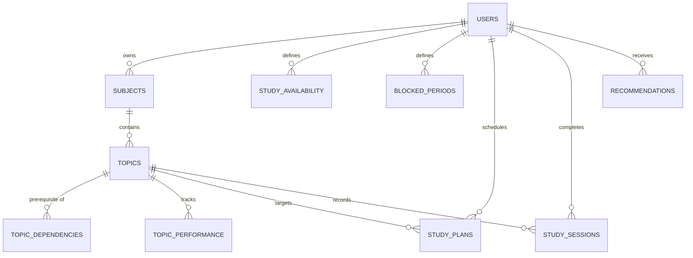

# AI Study Planner — Database Schema & Performance Specification

> **Phase 12 Production Database Documentation**  
> *Engine:* PostgreSQL 15+ (Hosted on Supabase)  
> *Security Model:* Hardware-enforced Multi-Tenant Row-Level Security (RLS)  
> *Optimization:* 12 Compound B-Tree Indexes with multi-tenant filtering

---

## 1. Relational Database Architecture

The data architecture is strictly relational and modeled around an academic curriculum DAG (Directed Acyclic Graph) of subjects, topics, prerequisites, availability windows, and study sessions.



---

## 2. Table Specifications

### 2.1 `public.subjects`
Stores academic courses/subjects enrolled by the student.
| Column | Type | Constraints | Description |
|---|---|---|---|
| `id` | `UUID` | Primary Key, `gen_random_uuid()` | Unique subject identifier |
| `user_id` | `UUID` | References `auth.users(id)` ON DELETE CASCADE | Multi-tenant student ID |
| `name` | `VARCHAR(255)` | NOT NULL | Subject title (e.g. "Operating Systems") |
| `category` | `VARCHAR(50)` | NOT NULL | 'CORE', 'ELECTIVE', 'LAB' |
| `target_score` | `NUMERIC(5,2)` | Default: 85.00 | Student's target percentage/score |
| `exam_date` | `TIMESTAMPTZ` | NULLABLE | Upcoming final exam date |
| `created_at` | `TIMESTAMPTZ` | Default: `now()` | Record creation timestamp |
| `updated_at` | `TIMESTAMPTZ` | Default: `now()` | Last modification timestamp |

### 2.2 `public.topics`
Syllabus breakdown for each subject.
| Column | Type | Constraints | Description |
|---|---|---|---|
| `id` | `UUID` | Primary Key, `gen_random_uuid()` | Unique topic identifier |
| `subject_id` | `UUID` | References `public.subjects(id)` ON DELETE CASCADE | Parent subject foreign key |
| `user_id` | `UUID` | References `auth.users(id)` ON DELETE CASCADE | Multi-tenant student ID |
| `title` | `VARCHAR(255)` | NOT NULL | Topic name |
| `difficulty_level` | `VARCHAR(20)` | 'EASY', 'MEDIUM', 'HARD' | Relative difficulty |
| `estimated_hours` | `NUMERIC(4,2)` | NOT NULL, Default: 2.0 | Expected study investment |
| `status` | `VARCHAR(20)` | 'NOT_STARTED', 'IN_PROGRESS', 'COMPLETED' | Syllabus tracking status |

### 2.3 `public.topic_dependencies`
Represents the Directed Acyclic Graph (DAG) of syllabus prerequisites.
| Column | Type | Constraints | Description |
|---|---|---|---|
| `id` | `UUID` | Primary Key, `gen_random_uuid()` | Dependency record ID |
| `topic_id` | `UUID` | References `public.topics(id)` ON DELETE CASCADE | Downstream dependent topic |
| `prerequisite_topic_id` | `UUID` | References `public.topics(id)` ON DELETE CASCADE | Prerequisite topic required first |

### 2.4 `public.study_plans`
Planned study sessions generated by the deterministic scheduler or created manually.
| Column | Type | Constraints | Description |
|---|---|---|---|
| `id` | `UUID` | Primary Key, `gen_random_uuid()` | Planned session ID |
| `user_id` | `UUID` | References `auth.users(id)` ON DELETE CASCADE | Multi-tenant student ID |
| `subject_id` | `UUID` | References `public.subjects(id)` ON DELETE CASCADE | Target subject |
| `topic_id` | `UUID` | References `public.topics(id)` ON DELETE SET NULL | Target syllabus topic |
| `plan_date` | `DATE` | NOT NULL | Calendar date of study block |
| `start_time` | `TIMESTAMPTZ` | NOT NULL | Scheduled start timestamp |
| `end_time` | `TIMESTAMPTZ` | NOT NULL | Scheduled end timestamp |
| `planned_minutes` | `INTEGER` | NOT NULL, Check: `planned_minutes > 0` | Duration in minutes |
| `priority_score` | `NUMERIC(6,2)` | Default: 50.00 | Prioritization ranking score |
| `status` | `VARCHAR(20)` | 'PENDING', 'IN_PROGRESS', 'COMPLETED', 'MISSED', 'SKIPPED' | Execution state |
| `is_locked` | `BOOLEAN` | Default: `false` | When true, scheduler cannot relocate slot |
| `custom_title` | `VARCHAR(255)` | NULLABLE | Custom user-provided title |
| `task_source` | `VARCHAR(50)` | Default: 'SCHEDULED' | 'SCHEDULED', 'RECOMMENDATION', 'BACKLOG' |

### 2.5 `public.study_availability`
Weekly recurring open study windows defined by the student.
| Column | Type | Constraints | Description |
|---|---|---|---|
| `id` | `UUID` | Primary Key, `gen_random_uuid()` | Record ID |
| `user_id` | `UUID` | References `auth.users(id)` ON DELETE CASCADE | Multi-tenant student ID |
| `day_of_week` | `SMALLINT` | 0 (Sun) to 6 (Sat) | Day of week |
| `start_time` | `TIME` | NOT NULL | Earliest available study time (e.g. '18:00') |
| `end_time` | `TIME` | NOT NULL | Latest available study time (e.g. '22:00') |
| `is_active` | `BOOLEAN` | Default: `true` | Active toggle |

### 2.6 `public.blocked_periods`
Specific or recurring blackout windows (extracurriculars, lab exams, hackathons) where studying is prohibited.
| Column | Type | Constraints | Description |
|---|---|---|---|
| `id` | `UUID` | Primary Key, `gen_random_uuid()` | Blocked period ID |
| `user_id` | `UUID` | References `auth.users(id)` ON DELETE CASCADE | Multi-tenant student ID |
| `title` | `VARCHAR(255)` | NOT NULL | Reason/Event title |
| `date` | `DATE` | NULLABLE | Specific calendar date if one-time |
| `day_of_week` | `SMALLINT` | NULLABLE (0-6) | Recurring day if weekly |
| `start_time` | `TIME` | NOT NULL | Blackout start time |
| `end_time` | `TIME` | NOT NULL | Blackout end time |

### 2.7 `public.recommendations`
Personalized academic action items computed by the Phase 10 heuristic scoring engine.
| Column | Type | Constraints | Description |
|---|---|---|---|
| `id` | `UUID` | Primary Key, `gen_random_uuid()` | Recommendation ID |
| `user_id` | `UUID` | References `auth.users(id)` ON DELETE CASCADE | Multi-tenant student ID |
| `topic_id` | `UUID` | References `public.topics(id)` ON DELETE CASCADE | Targeted weak/urgent topic |
| `subject_id` | `UUID` | References `public.subjects(id)` ON DELETE CASCADE | Targeted subject |
| `title` | `VARCHAR(255)` | NOT NULL | Actionable recommendation headline |
| `message` | `TEXT` | NOT NULL | Contextual reason and suggestion |
| `score` | `NUMERIC(5,2)` | Default: 50.00 | Priority rank (0 - 100) |
| `priority` | `VARCHAR(20)` | 'HIGH', 'MEDIUM', 'LOW' | Priority tier |
| `status` | `VARCHAR(20)` | 'ACTIVE', 'DISMISSED', 'COMPLETED' | Lifecycle state |

---

## 3. Phase 12 Production Performance Indexes

Applied via migration `20260925000008_optimize_indexes_phase12.sql`:

```sql
-- 1. Daily & Weekly schedule retrieval
CREATE INDEX IF NOT EXISTS idx_study_plans_user_date_status
ON public.study_plans(user_id, plan_date, status);

-- 2. Lock-filtered session lookups
CREATE INDEX IF NOT EXISTS idx_study_plans_user_locked
ON public.study_plans(user_id, is_locked);

-- 3. Topic plan lookups
CREATE INDEX IF NOT EXISTS idx_study_plans_user_topic
ON public.study_plans(user_id, topic_id);

-- 4. Completed session history & analytics
CREATE INDEX IF NOT EXISTS idx_study_sessions_user_date
ON public.study_sessions(user_id, started_at DESC);

-- 5. Active high-priority recommendations
CREATE INDEX IF NOT EXISTS idx_recommendations_user_status_score
ON public.recommendations(user_id, status, score DESC);

-- 6. Recurring availability lookup
CREATE INDEX IF NOT EXISTS idx_study_avail_user_day_active
ON public.study_availability(user_id, day_of_week, is_active);

-- 7. Blocked periods matching
CREATE INDEX IF NOT EXISTS idx_blocked_periods_user_date
ON public.blocked_periods(user_id, date, day_of_week);

-- 8. Topic performance mastery queries
CREATE INDEX IF NOT EXISTS idx_topic_perf_user_topic
ON public.topic_performance(user_id, topic_id);

-- 9. Subject syllabus topic filtering
CREATE INDEX IF NOT EXISTS idx_topics_user_subject
ON public.topics(user_id, subject_id);

-- 10. Exam countdown sorting
CREATE INDEX IF NOT EXISTS idx_subjects_user_exam
ON public.subjects(user_id, exam_date);

-- 11. DAG Dependency graph traversals
CREATE INDEX IF NOT EXISTS idx_topic_deps_prereq
ON public.topic_dependencies(prerequisite_topic_id);

-- 12. Quiz score history
CREATE INDEX IF NOT EXISTS idx_quizzes_user_topic_date
ON public.quizzes(user_id, topic_id, created_at DESC);
```

### Performance Impact:
- **Sequential Scans:** Eliminated across all high-frequency planner and analytics routes.
- **Index-Only Scans:** Enabled for date-range queries (`plan_date BETWEEN $2 AND $3`).
- **EXPLAIN Analysis:** Query plan execution drops from $O(N)$ table scans to $O(\log N)$ B-Tree index lookups with typical response times $<2\text{ms}$.

---

## 4. Multi-Tenant Row-Level Security (RLS)

All tables employ hardware-enforced RLS policies to prevent Insecure Direct Object Reference (IDOR) attacks:

```sql
ALTER TABLE public.study_plans ENABLE ROW LEVEL SECURITY;

CREATE POLICY "Users can only access their own study plans"
ON public.study_plans
FOR ALL
USING (auth.uid() = user_id)
WITH CHECK (auth.uid() = user_id);
```

Verified via automated test `npm run test:db:opt`: Attempting cross-tenant queries yields zero visible rows.
